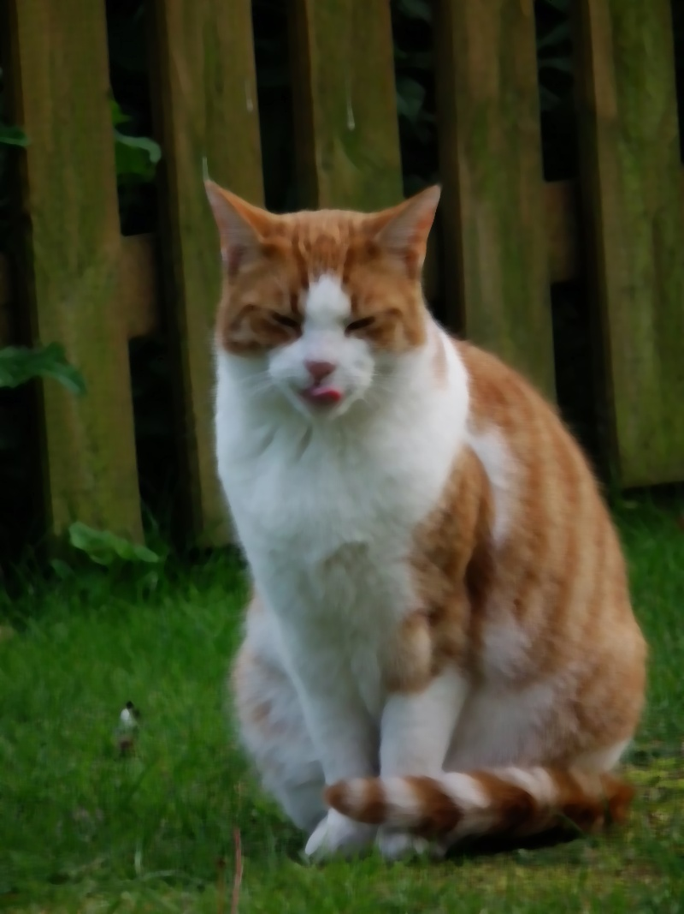
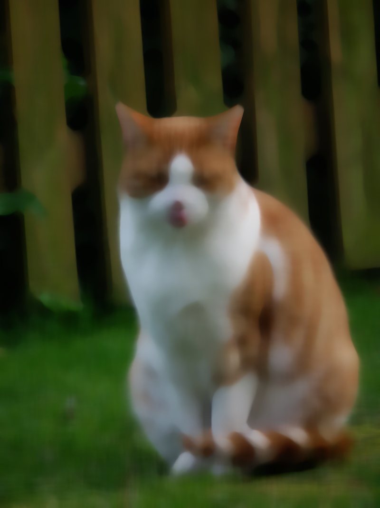
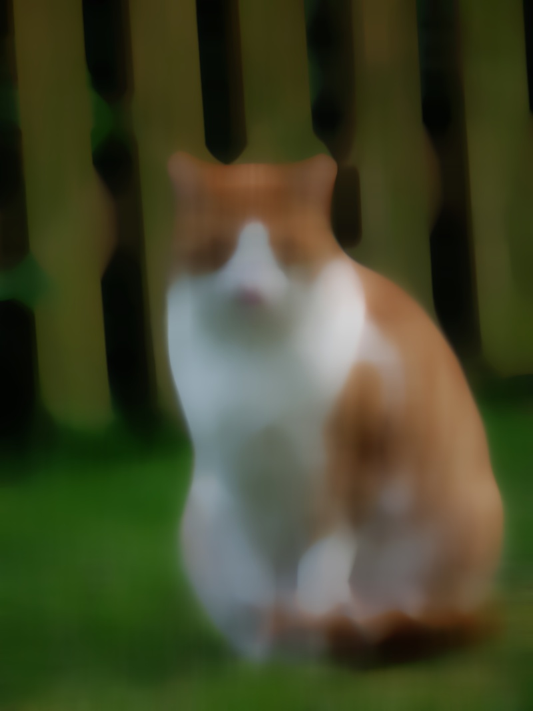
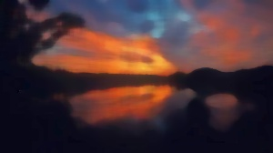

# Медианный фильтр основанный на сортировке

## Реализация

Реализация алгоритма находится в файлах [ConstMedianFilter.h](../include/Filters/ConstMedianFilter.h) и [ConstMedianFilter.сpp](../include/Filters/ConstMedianFilter.cpp). Строится окно с заданным размером, которое постепенно передвигается по изображению. Все комментарии по поводу перемещения окна аналогичны [Huang](./Huang.md). Отличием является перемещение не по пикселям следующего столбца, а по целому столбцу. Создаются столбцы на каждый столбец картинки. При движении влево или вправо будет добавлен результат столбца (складываются гистограммы окна и столба) и вычтен результат столбца с другой стороны матрицы. Когда достигается край картинки все столбцы опускаются на 1 пиксель. Эта операция более дружественна к кешам, так как мы идем по линиям из картинки.

## Результаты

Все результаты можно найти в папке `pictures/Const_results`. Посмотрим на некоторые из них:

Кот при размере окна равном 9:

Кот при размере окна равном 19:

Кот при размере окна равном 29:

Кот при размере окна равном 59:

Пейзаж при размере окна 3

Пейзаж при размере окна 11

Пейзаж при размере окна 19

Пейзаж при размере окна 43

Пейзаж при размере окна 99

## Теоретическая оценка асимптотики

Допустим на вход подается изображение размером `M x N` и радиус окна `R` (обращу внимание, что под радиусом понимается половина аргумента используемого в моей реализации). Для каждого пикселя этого изображения используется 3 канала. Глубина цвета 255 (обозначим ее за $D$).

### Оценка времени работы

Инициализация столбцов требует $O \left((2R + 1) \cdot N \right)$ операций (добавить все пиксели).

Инициализация окна требует $O \left((2R + 1)^2 \right)$

Так как приведенные выше операции выполняются лишь один раз, то они не внесут большого вклада в итоговую асимптотику (MN >> R)

Шаг можно представить как три действия: опустить следующий столбец на 1 ячейку вниз (удаление и добавление пикселя в столбец делаются за O(1)), добавить новый столбец и удалить столбец с другой стороны (эти действия требуют $O(D)$ операций над гистограммами внутри структур).

В итоге операций всего $O(M\cdot N \cdot (1 + D)) = O(MND)$ &mdash; все эти переменные являются константами картинки (поэтому такой подход и называется константным).

### Оценка доп памяти
На все колонки требуется $O(N \cdot 3 D) = O(N D) $ дополнительной памяти. На каждую колонку под каждый канал гистограмма размера $D$. Всего N колонок.

На двигающееся окно требуется $O(3D)$. То есть просто память под гистограмму для каждого канала. 

### Итог
Память: $O(N \cdot D)$

Время: $O(M\cdot N \cdot D)$ 

## Фактическая оценка асимптотики

Обратим внимание на графики:

Для кота

Для пейзажа

На графике с картинкой кота видно, что требуемое количество секунд постепенно перерастает в константу. В начале график не ведет себя как константа, так как могут играть роль переходы вниз для окна (они все еще выполняются поэлементно, но для малых размеров, как у нас это быстрее, чем сумма гистограм).

Так как пейзаж - довольно маленькая картинка, и ее высота сопоставима с радиусом окна, то для нее нельзя пренебрегать слагаемыми при инициализации и они как раз задают вид графика. 

**Вывод** фактическая асимптотика работы в полученно части постепенно выходит на совпадение с теоретической.

__Замечание__: Подробние о получении всех графиков можно прочесть [здесь](./Tests.md). А о результатах [здесь](./Results.md).