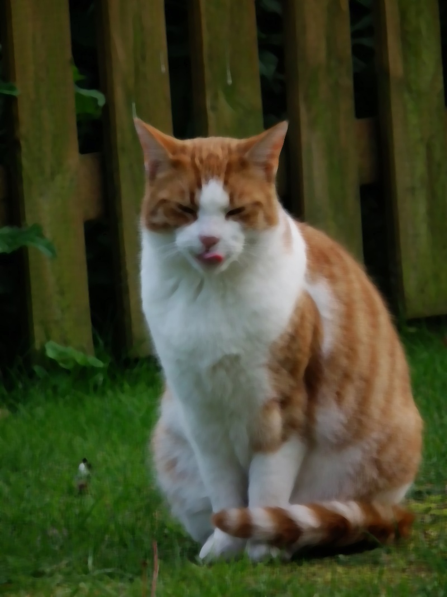
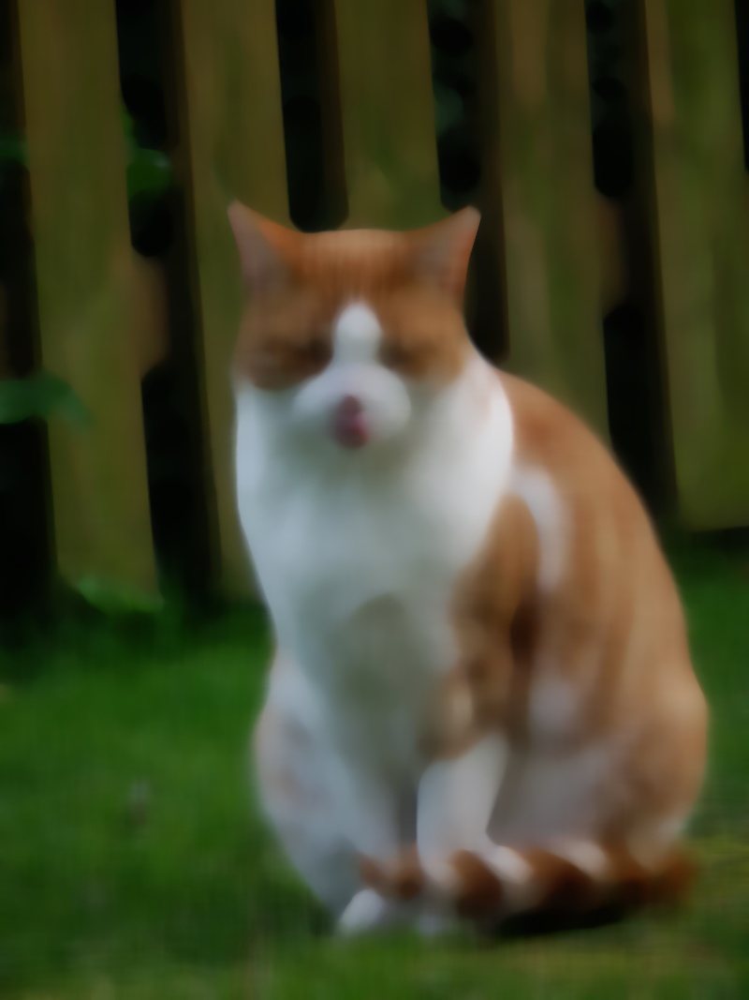
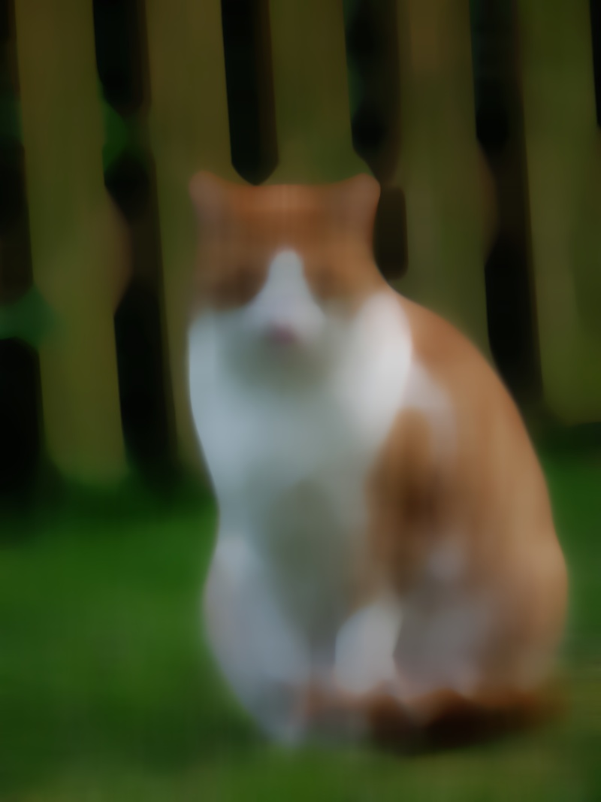
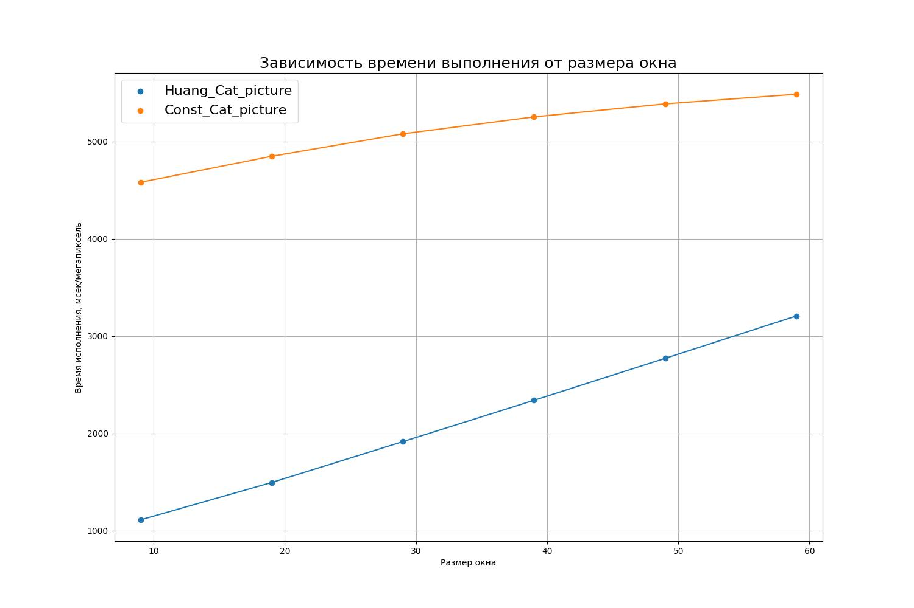
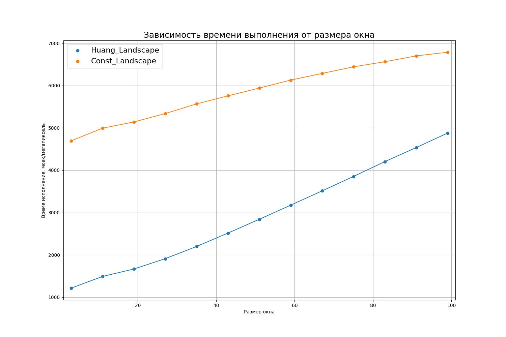

# Медианный фильтр основанный на сортировке

## Реализация

Реализация алгоритма находится в файлах [HuangMedianFilter.h](../include/Filters/HuangMedianFilter.h) и [HuangMedianFilter.сpp](../include/Filters/HuangMedianFilter.cpp). Строится окно с заданным размером, которое постепенно передвигается по изображению. В отличие от оригинальной реализации перемещение было сделано зиг-загами. Так как на каждом этапе при проходе по линии нам достаточно добавлять и удалять ограниченное число пикселей, то скорость значительно выше, чем в `Sort`. Перемещение зиг-загом было реализовано для избежания повторного создания окна при достижении границы (то есть абсолютно все операции перехода имеют одинаковую асимптотику).

В пределах окна поддерживается гистограмма для каждого канала. Это позволяет за $O(1)$ удалять и добавлять новые значения, однако поиск медианы занимает теперь $O(n)$.

## Результаты

Все результаты можно найти в папке `pictures/Huang_results`. Посмотрим на некоторые из них:

Кот при размере окна равном 9:

Кот при размере окна равном 19:

Кот при размере окна равном 29:

Кот при размере окна равном 59:

Пейзаж при размере окна 3

Пейзаж при размере окна 11

Пейзаж при размере окна 19

Пейзаж при размере окна 43

Пейзаж при размере окна 99

## Теоретическая оценка асимптотики

Допустим на вход подается изображение размером `M x N` и радиус окна `R` (обращу внимание, что под радиусом понимается половина аргумента используемого в моей реализации). Для каждого пикселя этого изображения используется 3 канала. Глубина цвета 255 (обозначим ее за $D$).

### Оценка времени работы

На каждом шаге необходимо добавить и удалить $2R + 1$ ячейку. Добавление и удаление осуществляется за $O(1)$. Поиск медианы за $O(D)$. Суммарно на одном шаге $O(R + D)$. В наших тестах $R < D$, поэтому пренебрегать $D$ ей нельзя. 

В итоге операций всего $O(M\cdot N \cdot (R + D))$.

### Оценка доп памяти
На каждом шаге требуется $3 \cdot D$ ячеек памяти (хранение трех каналов окна в виде гистограммы). Но этот объем памяти выделяется разово, поэтому мы не пребегаем к тяжелым операциям создания объектов.

### Итог
Память: $O(D)$

Время: $O(M\cdot N \cdot (R + D))$ 

## Фактическая оценка асимптотики

Обратим внимание на графики:

Для кота

Для пейзажа

Из графика легко убедиться в линейности асимптотики в зависимости от размера окна. Незначительный выброс в начале может возникать из-за разной степени заполняемости гистограммы (на некоторых картинках возможно существования такого радиуса, при котором придется чаще переходить до конца картинки).

**Вывод** фактическая асимптотика работы совпала с теоретической.

__Замечание__: Подробние о получении всех графиков можно прочесть [здесь](./Tests.md). А о результатах [здесь](./Results.md).