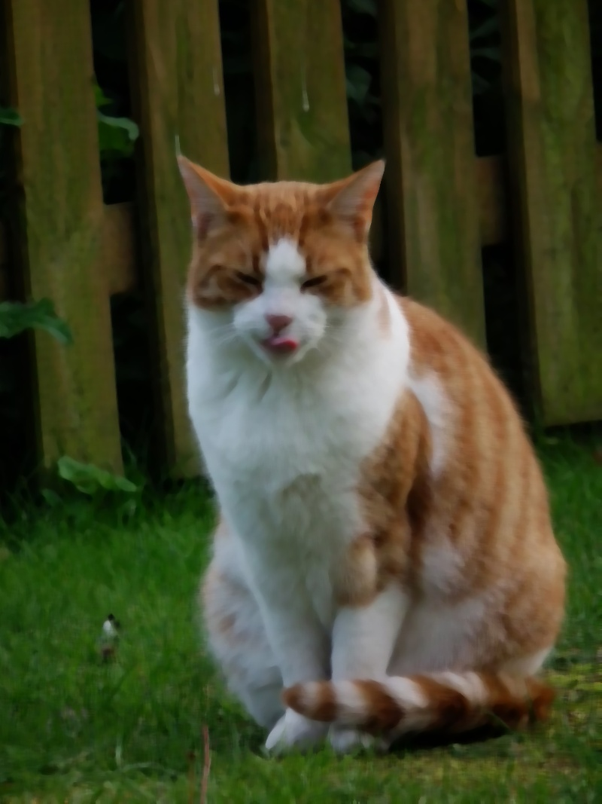
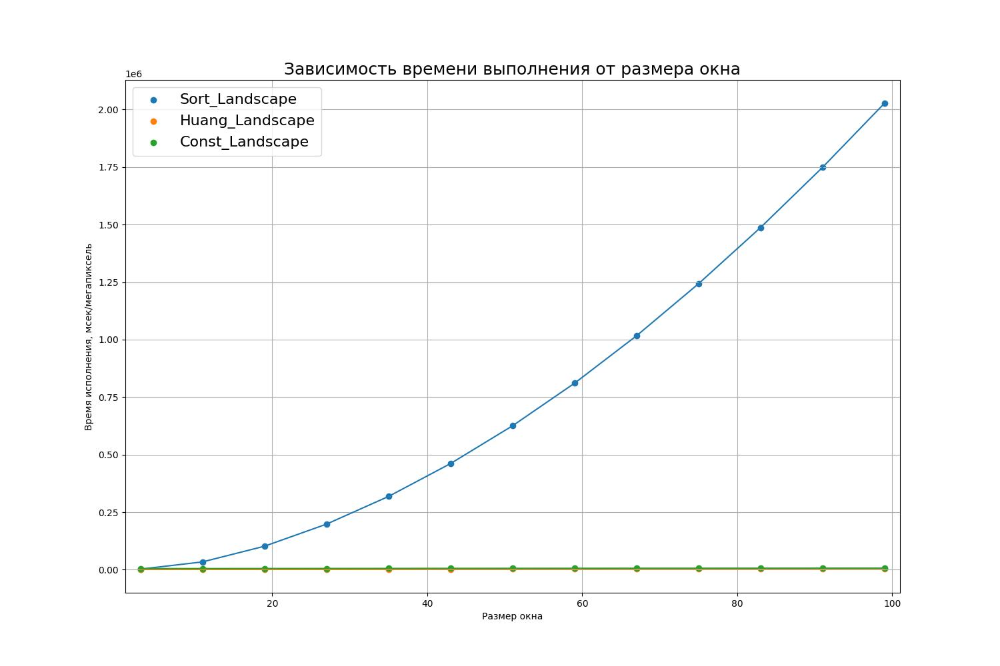
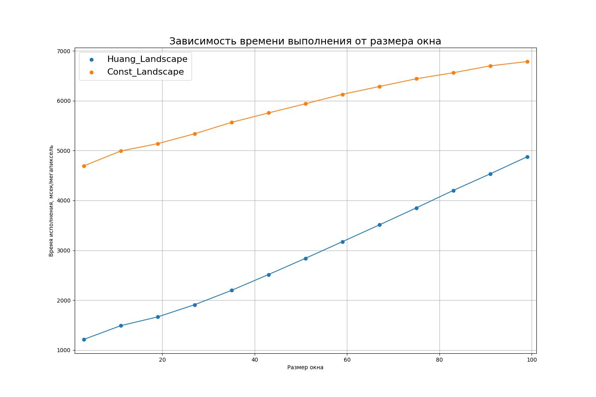

# Вывод к работе

В работе сравниваются три варианта медианного фильтра, подробнее о каждом можно прочесть в соответствующих статьях ([Sort](./Sort.md), [Huang](./Huang.md), [Const](./Const.md)).

## Сравнение результатов алгоритмов

Размер окна 9, картинка кот:

Sort:

Huang:

Const:

Размер окна 19, картинка кот:

Sort:

Huang:

Const:

Размер окна 49, картинка кот:

Sort:

Huang:

Const:

Размер окна 3, картинка пейзаж:

Sort:

Huang:

Const:

Размер окна 11, картинка пейзаж:

Sort:

Huang:

Const:

Размер окна 19, картинка пейзаж:

Sort:

Huang:

Const:

Размер окна 43, картинка пейзаж:

Sort:

Huang:

Const:

Размер окна 99, картинка пейзаж:

Sort:

Huang:

Const:

**Вывод** Алгоритмы работают одинаково, как и ожидалось.

## Скорость работы алгоритмов

Графики скорости работы для картинки кота:

Графики скорости работы для картинки пейзажа:

Оценки памяти и времени можно найти в файлах, посвященных самим алгоритмам ([Sort](./Sort.md), [Huang](./Huang.md), [Const](./Const.md))

Коротко:
* `Sort`
   1. Память: $O ((2R + 1)^2) $
   2. Время: $O(M\cdot N \cdot R^2 \log R)$ 

* `Huang`
   1. Память:$O(D)$
   2. Время: $O(M\cdot N \cdot (R + D))$ 

* `Const`
   1. Память: $O(N \cdot D)$
   2. Время: $O(M\cdot N \cdot D)$ 

## Сравнение с opencv 

Скорость на картинку (не мсек/мегапиксель, а секунд на всю картинку)

|picture|opencv|Sort|Huang|Const|
|-|-|-|-|-|
|landscape| (2.9e-05 - 0.004593)| (0.127096 - 102.173)| (0.061134 - 0.24577)| (0.236478 - 0.34202) | 
|cat| (0.000191 - 0.078716) | (21.4803 - 772.894) | (0.948004 - 2.73701) |  (3.90966 - 4.68232) |

Результат выполнения для кота:

Результат выполнения для пейзажа:

Результаты работы алгоритма и opencv:

Кот для sort размера 9:

Кот для opencv размера 9:

Кот для sort размера 29:

Кот для opencv размера 29:

__Вывод для сравнения__

OpenCV значительно быстрее выполняет алгоритм, при этом в начале у нее наблюдается всплеск (медленное выполнение), а затем он переходит на константную асимптотику. Алгоритм работает быстрее, так как в нем много оптимизаций в обращении с памятью. 

Что касается результатов, то для библиотеки и собственной реализации они совпадают.

## Предложене использования алгоритмов

Исходя из графиков Sort является не оптимальным и его использование не поможет ни в одном из случаев.

Если посмотреть на следующий график:

то можно придти к выводу, что наступит $R\approx 200$, когда `Huang` будет выполняться дольше `Const`.

__Рекомендация__: Если диаметр окна меньше 200, то используем `Huang`, иначе используем `Const`.
