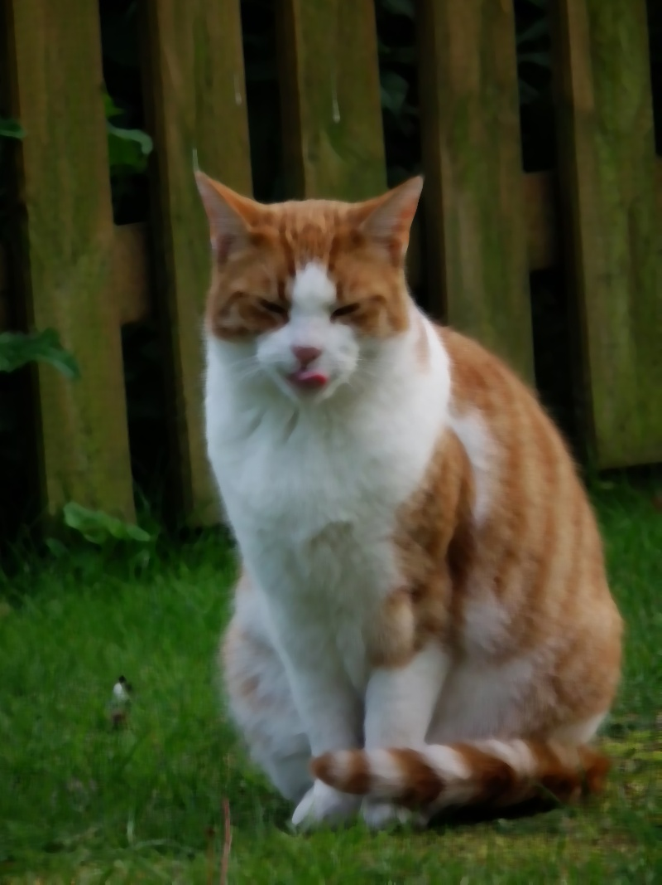
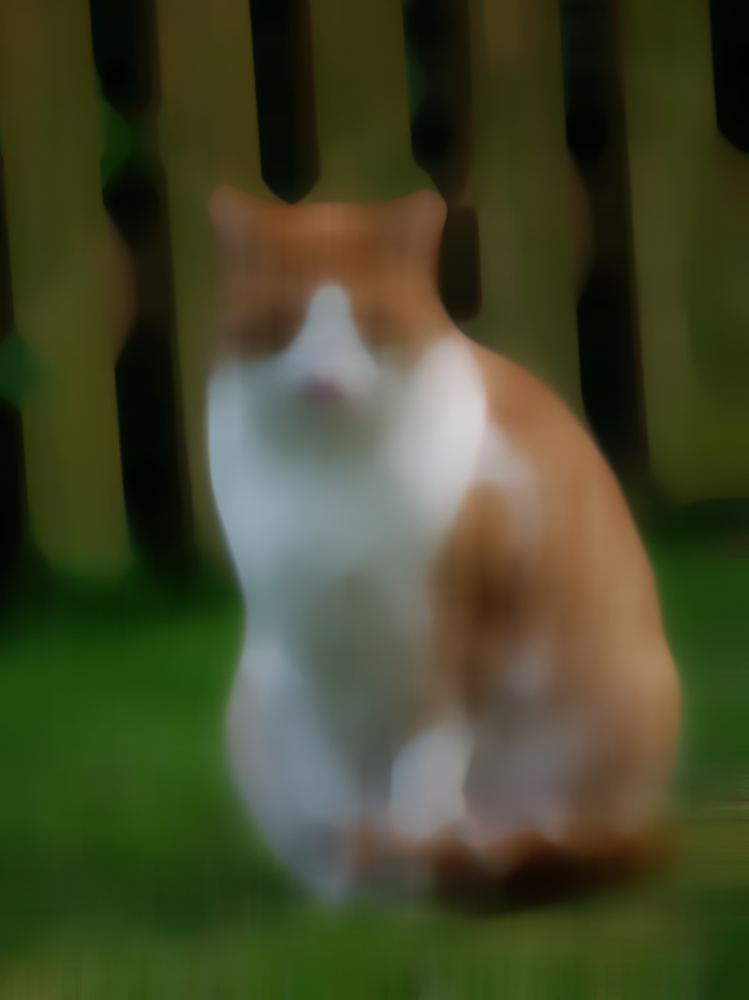
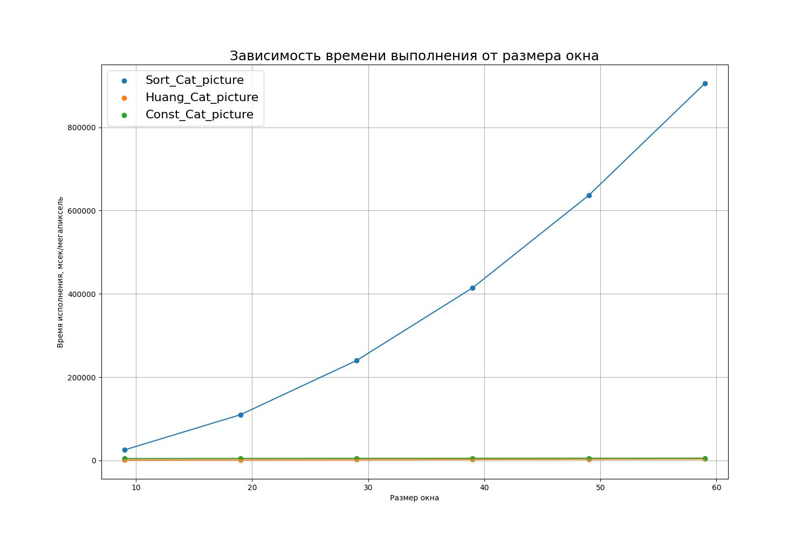
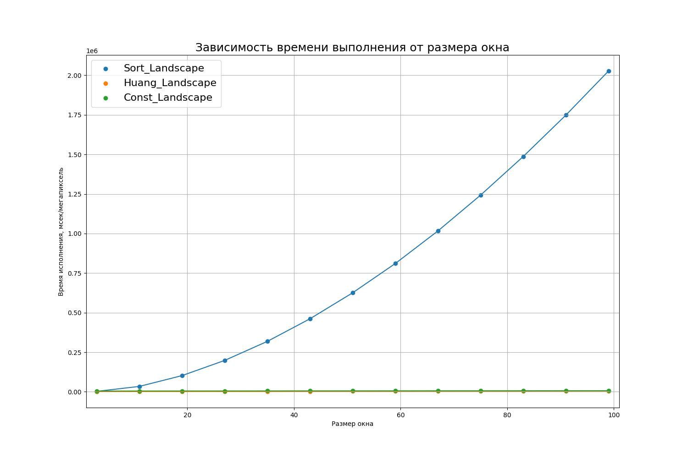
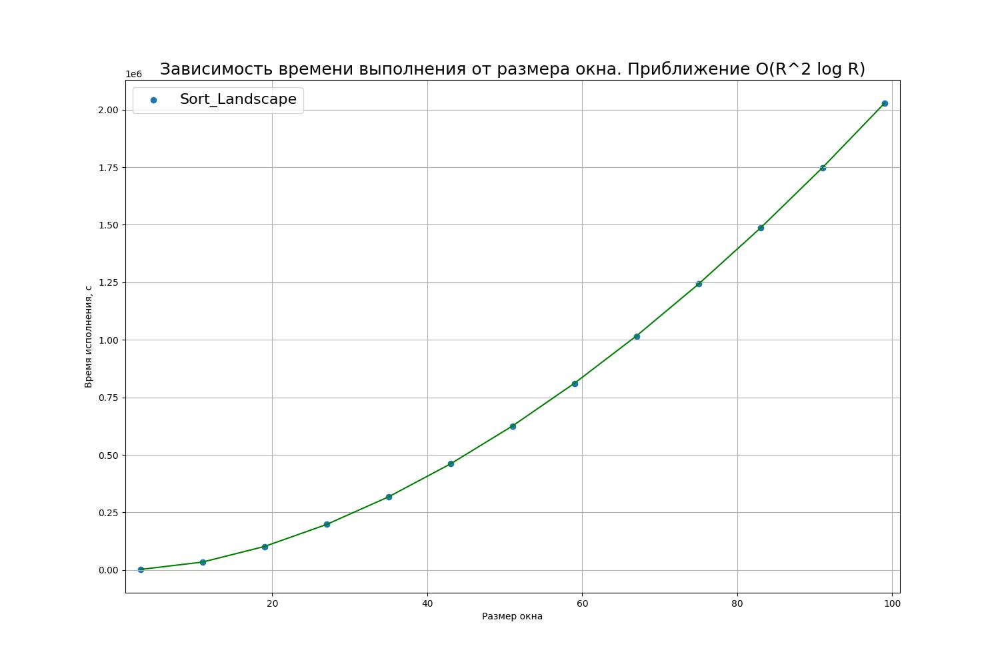
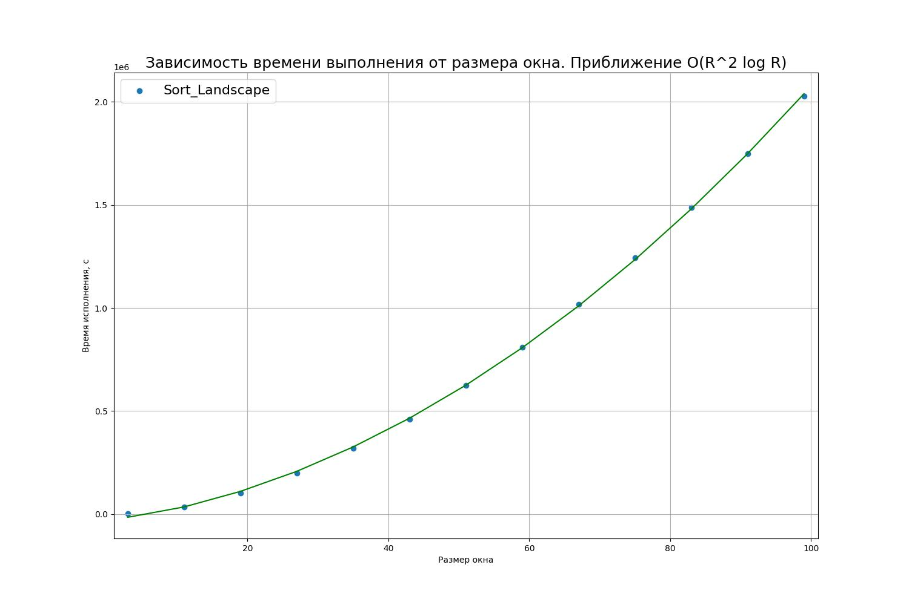
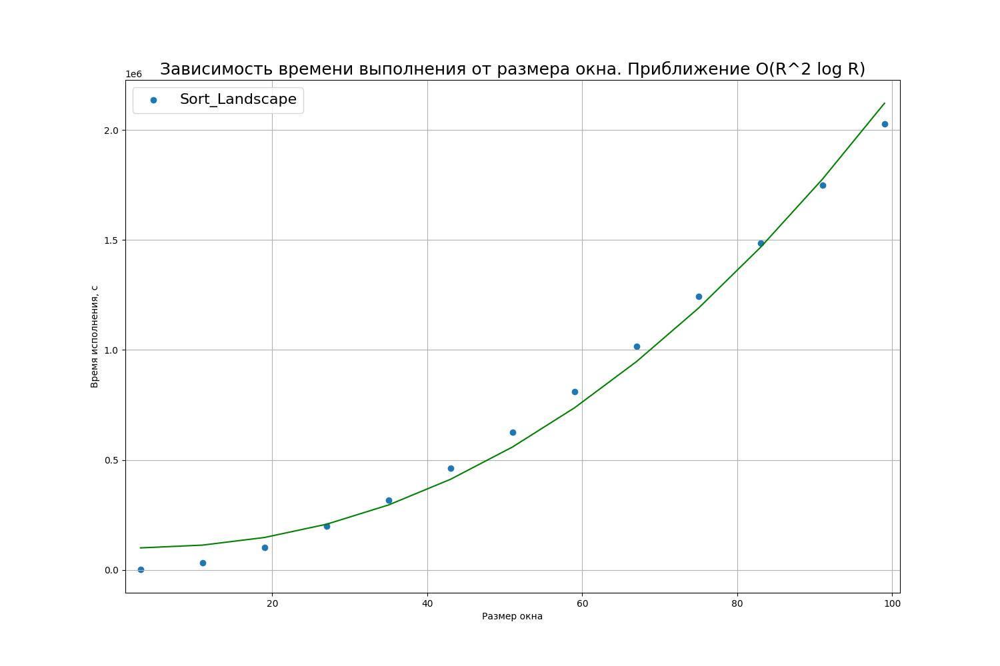

# Медианный фильтр основанный на сортировке

## Реализация

Реализация алгоритма находится в файлах [SortMedianFilter.h](../include/Filters/SortMedianFilter.h) и [SortMedianFilter.сpp](../include/Filters/SortMedianFilter.cpp). Для каждого пикселя строится окно диаметром `window_size_`. Для каждого канала массив значений в окне сортируется и берется центральный элемент (медиана). Важно, что в реализации используется паддинг вдоль границ. Если мы запрашиваем пиксель, который находится за границей, то будет выдан пиксель в пределах границы. Аналогичный принцип используется в opencv, если верить документации.

## Результаты

Все результаты можно найти в папке `pictures/Sort_results`. Посмотрим на некоторые из них:

Кот при размере окна равном 9:

Кот при размере окна равном 19:

Кот при размере окна равном 29:

Кот при размере окна равном 59:

Пейзаж при размере окна 3

Пейзаж при размере окна 11

Пейзаж при размере окна 19

Пейзаж при размере окна 43

Пейзаж при размере окна 99

## Теоретическая оценка асимптотики

Допустим на вход подается изображение размером `M x N` и радиус окна `R` (обращу внимание, что под радиусом понимается половина аргумента используемого в моей реализации). Для каждого пикселя этого изображения используется 3 канала. 

### Оценка времени работы

На каждом шаге обрабатывается суммарно $(2R + 1)^2$ пикселей. Построение окна занимает $O(R^2)$ операций. При этом вызывается сортировка, занимающая $O(R^2 \log R)$ (проведено сокращение констант).

В итоге операций всего $O(M\cdot N \cdot R^2 \log R)$ (слагаемое с $R^2$ входит в эту асимптотику).

### Оценка доп памяти
На каждом шаге требуется $3 \cdot (2R + 1)^2$ ячеек памяти (хранение трех каналов окна). Больше затрат на дополнительную паять нет. После выполнения операций эта память освобождается.

### Итог
Память: $O ((2R + 1)^2) $

Время: $O(M\cdot N \cdot R^2 \log R)$ 

## Фактическая оценка асимптотики

Обратим внимание на графики:

Для кота

Для пейзажа

Легко увидеть, что этот алгоритм не самый оптимальный и что его вид похож на теоретическую оценку времени. Чтобы убедиться, что мы были правы, попробуем приблизить результат классом функций из $O(R^2 \log R)$ (так как в случае одинаковых картинок можно считать размер картинки константой и он не участвует в асимптотике).

$$Ax^2 \log x + Bx\log x + C\log x + D x^2 + Ex + H$$

$$Ax^2 \log x + Bx\log x + C\log x + D x^2 + H$$

$$Ax^2 \log x + Bx\log x + C\log x + H$$

$$Ax^2 \log x + Bx\log x + H$$

$$Ax^2 \log x + H$$

**Вывод** функции хорошо приближают полученный результат, то есть фактическая асимптотика работы совпала с теоретической.

__Замечание__: Подробние о получении всех графиков можно прочесть [здесь](./Tests.md). А о результатах [здесь](./Results.md).